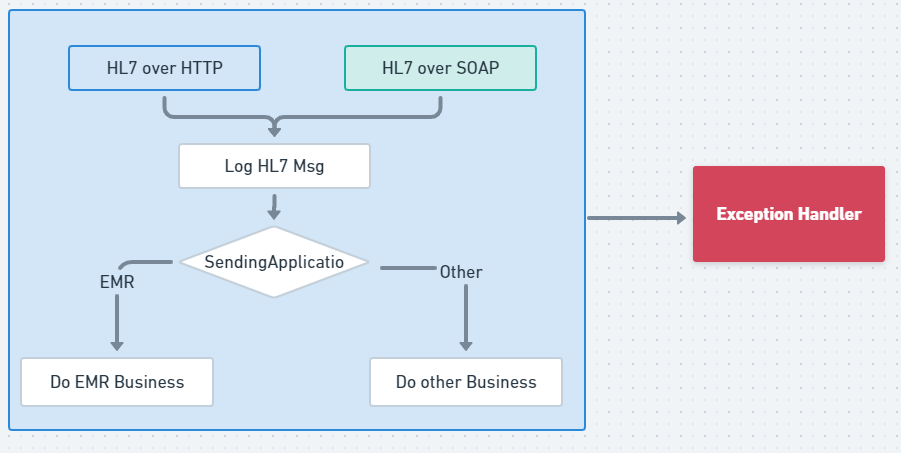

## 集成ESB Demo项目

## 启动
直接运行  DemoApplication 即可

## 用法

以不同的协议请求导出的Endpoint


## 模拟请求的数据
```hl7
MSH|^~\&|EMR||Pivas||202101121548||OMP^O09^OMP_O09|aa797be5-0a5e-4808-8cc0-3a2099b6f408|P|2.6|||NE|AL||utf-8
PID||2001663067|||yzx^^^YU ZIII XXX||20170611|2
PV1||2|2104^210402^004^213401||||101265^NSA||||||||||||1||||||||||||||||||||H0002|||||20180217164200
ORC|OH|18163001||20014797|||||20210112154750|||LEIP^PN|||||||||儿科病区^^210402||||||||A
TQ1|1||1&1/日||||20210112154750|||1
RXO|V020.002TA06^维生素B2片^^5mg@华中药业(100)|5||10^mg||||||||||||||||0^否||||||||||||21250101
RXR|B5^静滴
```


## 导出的Endpoint

http://host:port/camel/hl7 以HTTP POST 方式请求此接口

http://host:port/services/hello?wsdl 调用此接口的 sayHi方法传递 HL7 body

## 流程图


